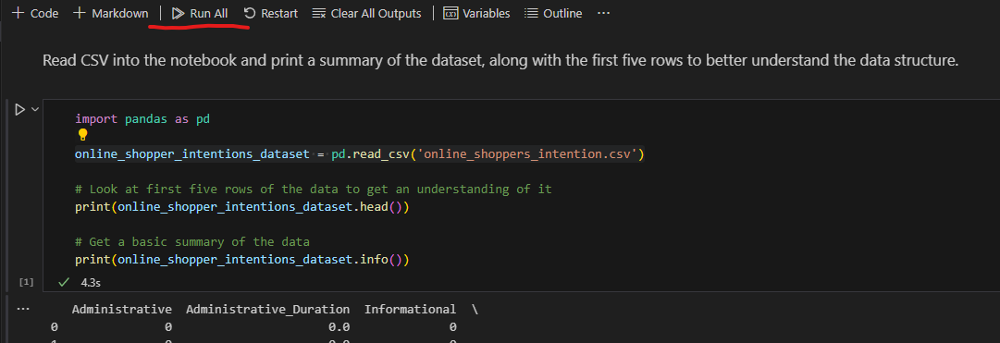
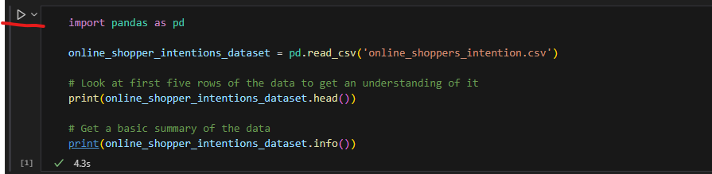

# Group Online Shoppers According to their Intention to Buy using different clustering Algorithms
This assignment was created for my CAP6610 - Machine Learning class taught by Dr. Liu at the University of North Florida. The intention of the project
is to cluster similar examples using KMeans and Complete Linkage Agglomerative Clustering, and to measure the performance of these clustering models
by comparing their clustering predictions to the ground truth clustering given by the Revenue column which is preprocessed to store two clusters, 0 (does not buy), and 1 (does buy). The actual qualitity of these model predictions is given by the Rand Index of the model clustering and the ground truth clustering. The Rand Index is essentially the number of agreeing pairs divided by the number of pairs. I recommend seeing the following YouTube video for an excellent explanation on this topic if you are not familiar with Rand Index : https://www.youtube.com/watch?v=-UBChMttQOI

## Dataset
This project uses the Online Shoppers Intention dataset which can be retrieved from the UCI Machine Learning Repository. It is also included in this repository directory so the notebook script can function properly. It contains various features about users visiting a webpage, and whether or not these users made a purchase. This purchase decision is the target feature or the `Revenue` column. A better descrption of the dataset can be found by reading The Data section of the `Assignment3.pdf` file.

## Requirements
- Python 3
- Third Party libaries:
    - Pandas
    - Sklearn

## Setup
1. Install Python 3
2. Download the repository zip, and extract the project repository folder to your work directory with the Juypter Notebook script and the dataset included.
3. Install required Python packages
- `pip install pandas scikit-learn`
- Alternatively, you may forgo the requirement to install requirements by using the Anaconda Python environment as I did.
4. Download a .ipynb editor of your choice to use the script, I personally use Visual Studio Code with the official Juypter notebook extension.
- See the following useful video for more instructions on how to do this : https://www.youtube.com/watch?v=h1sAzPojKMg

## Running the Code 
1. Once you have your Juypter Notebook editor setup, simply press the run all button above the first cell to execute the script.

2. Alternatively, press the run button for each cell one at a time, in order, top to bottom, to achieve the same result.

## Different Sklearn Classes Used
- https://scikit-learn.org/stable/modules/generated/sklearn.cluster.KMeans.html
- https://scikit-learn.org/stable/modules/generated/sklearn.cluster.AgglomerativeClustering.html
- https://scikit-learn.org/stable/modules/generated/sklearn.metrics.rand_score.html